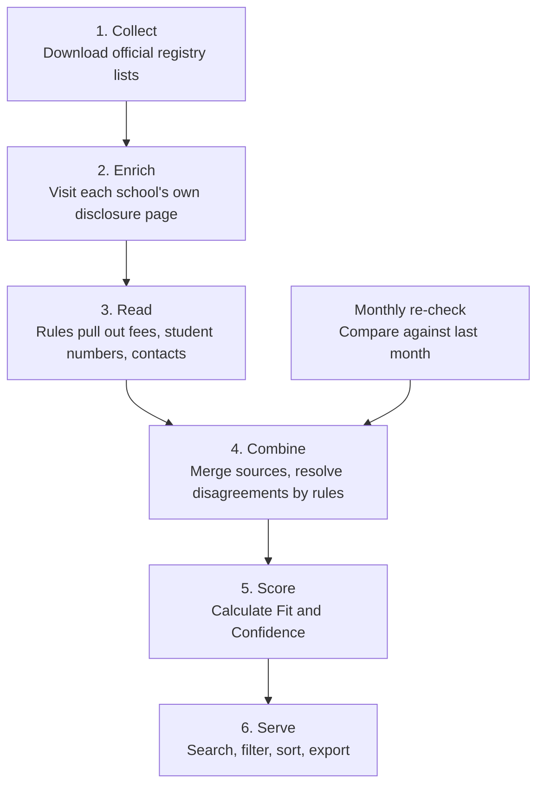

# Tensor School Intelligence — Product Requirements

**Status:** Architecture approved, build not started
**Last updated:** 22 August 2026
**Audience:** Everyone. No technical background needed for sections 1–8.

---

## 1. The short version

We're building an internal tool that answers one question well:

> **"Which schools and colleges should we approach next to recruit students for our B.Tech program — and who do we call there?"**

Today that answer takes hours of Googling and spreadsheet work per city. We want it to take about a minute.

Five things to know up front:

- It ranks **institutions**, not students. It tells you which schools are worth your time and who the contact is. It never builds a list of individual students — that's a legal line we don't cross, and section 7 explains why.
- It gets most of its data from **official government and exam-board registries**, which are free and reliable. It is not a web scraper that wanders the internet hoping for the best.
- It runs on **no paid services and no AI inference**. Everything is rule-based, which makes it free to run, fast, and repeatable — the same page always produces the same answer.
- Every number it shows can be traced back to the exact source sentence it came from. If a school says its fee is ₹1.85L, you can see where it said that and when.
- It's deliberately built small: one database, one background process. No large infrastructure to babysit.

---

## 2. The problem today

When BD wants to find schools to approach in a new city, the current process is:

1. Google "top CBSE schools in Pune"
2. Open ten directory sites of unknown accuracy
3. Visit school websites one by one looking for fees, size, and a contact
4. Copy fragments into a spreadsheet
5. Guess which ones are actually worth calling

This is slow, it doesn't scale past a handful of cities, and two people doing it produce different lists. Worse, the most important filter — *can these families actually afford ₹6L a year?* — usually gets skipped entirely, because fee data is the hardest thing to find manually.

Our program costs **₹24L over four years** (₹5L tuition + ₹1L technology fee per year, plus hostel). That single number should drive everything about who we target, and right now it drives nothing.

---

## 3. Who this is for

| User | What they need |
|---|---|
| **BD / outreach team** (primary) | A ranked, exportable list of institutions with a named contact and a reason for each. This is the main use. |
| **Marketing** | Which cities and school segments have the most qualified students, to aim campaigns at. |
| **Leadership** | Where our addressable market actually is, and how much of it we've covered. |

Expected usage: a small team, roughly 5–20 people. The tool's real output is often a spreadsheet someone works through, not a dashboard someone stares at. We're building it that way.

---

## 4. What a user can do

### Search and filter

Find institutions by any combination of:

- **Location** — state, district, city, or metro area (Delhi NCR correctly includes Gurugram and Noida, which "Delhi" alone would miss)
- **Curriculum** — CBSE, ICSE/ISC, IB, Cambridge, state boards. Schools with two curricula show up under both.
- **Fee level** — the filter that matters most
- **Student numbers** — see the note below, because this means three different things
- **Type** — school, PU/junior college, or coaching campus
- **Streams** — has Science / PCM
- **Score** — minimum Fit, minimum Confidence
- **Data quality flags** — e.g. "show me only institutions where we've confirmed the fee"

### Sort

By **Fit score**, **Confidence**, **fee**, or **student numbers**.

**A note on "number of students," because it's genuinely ambiguous.** An institution has three different student counts, and they can point in opposite directions:

| Sort option | What it means | When you want it |
|---|---|---|
| **PCM Class 12** | Science-stream students in class 12 | **The default.** These are our actual candidates. |
| **Class 12 total** | All streams in class 12 | Rough sense of the graduating batch |
| **Total enrollment** | The whole institution, all grades | Sense of overall size and prestige |

A 5,000-student K–12 school might have only 60 PCM students in class 12. An 800-student school might have 200. **The second one is the better lead**, and sorting by total enrollment would hide that completely. All three are available and clearly labelled so you always know which number you're looking at.

### See why

Open any institution and see:

- Everything we know: location, curricula, fees, student numbers, contacts, group affiliation
- **The score, broken down** — not just "82/100" but which component contributed what
- **The source of every single value** — which website or registry, on what date, and the exact sentence it came from
- Where two sources disagree, both values with their sources, rather than us silently picking one
- Recent changes: new affiliation, upgraded to senior secondary, principal changed

### Export

The list, with your filters and your sort order preserved, as CSV or Excel — including contacts and the reasons behind each score. This is the deliverable most people will actually use.

### Ask in plain English *(optional, later)*

Type *"CBSE and IB schools in Bengaluru with fees above 2 lakh and more than 100 PCM students"* and get the same result as building those filters by hand. The plain-English box translates into the normal filters and shows you what it understood, so you can correct it — a shortcut to the filters, not a separate magic search.

This is the one feature that would need an AI service, so it's **switched off for the prototype**. The filter controls cover the same ground; this is convenience, not capability.

### Correct mistakes

If the tool gets something wrong, a reviewer can fix it. **Corrections stick permanently** — they survive every future data refresh and always beat the automated value. Every correction records who made it and why.

---

## 5. How institutions get scored

Two separate numbers. This distinction matters, and it's the thing most likely to be misread.

### Fit — "how good a target is this?"

Out of 100, built from six things:

| What we measure | Weight | Why it matters |
|---|---|---|
| **Affordability** | 30% | Can these families fund ₹6L/year? The single hardest qualifier. |
| **PCM Class 12 size** | 25% | How many actual candidates are here |
| **Curriculum** | 15% | IB and Cambridge families have proven willingness to pay; state board least |
| **Location** | 15% | Bengaluru first, then Karnataka, then metros — tunable |
| **Reachability** | 10% | Is there a named contact we can actually call? |
| **Group leverage** | 5% | Would one relationship open several campuses? |

**On affordability — it is not "richer is always better."** The curve peaks in the middle:

- School fee under ₹50k/year → scores **zero**. Not a weak lead, a non-lead. A family paying ₹50k/year for school cannot fund ₹6L/year for college.
- **₹1.5L–3L/year → the sweet spot.** Comfortably able to pay, and a private engineering degree is the expected next step.
- Above ₹10L/year → still good, but scores slightly lower, because those families are seriously weighing overseas study.

This is why a modest-fee college with 2,000 Science students ranks below a small IB school with 90. It's counterintuitive, it's correct, and the score breakdown will show you the reasoning every time.

### Confidence — "how much of this do we actually know?"

Also out of 100, and **kept completely separate from Fit.** It measures how complete, how authoritative, and how recent our data is.

Why separate: if we folded them together, a school we know nothing about would look identical to a school we know is small. Those are completely different situations. Keeping them apart means:

- **High Fit, high Confidence** → call these first
- **High Fit, low Confidence** → promising, needs verification. This is your enrichment backlog.
- **Low Fit, high Confidence** → confidently not a target. Skip.

Missing data lowers Confidence. It does **not** pretend the missing value was bad. A school with unknown fees is scored on what we do know, with the gap clearly marked.

### Flags

Never affect the score, always visible: `fee unverified`, `fee disputed`, `student count estimated`, `principal data stale`, `possible franchise network`, `no website found`.

---

## 6. Where the data comes from

All free, all official, all public.

| Source | What it gives us | How often |
|---|---|---|
| **CBSE affiliation registry** | ~29,000 schools: name, address, website, **principal**, class levels, and the **trust/society that owns it** | Monthly |
| **School's own disclosure page** | CBSE legally requires every school to publish **fee structure**, **class-wise student numbers**, and contacts on its own site | Twice a year |
| **CISCE** | ICSE and ISC schools | Quarterly |
| **IB and Cambridge** | ~800 international-curriculum schools — our highest-value segment | Quarterly |
| **UDISE+** (government) | Management type, medium of instruction, verified total enrollment | Yearly |
| **Coaching group directories** | Narayana, Deeksha, BASE and similar publish their own campus lists — Narayana alone has 950+ | Quarterly |

Two things worth highlighting for anyone who assumed this would be hard:

**Fee data exists and it's official.** CBSE requires every affiliated school to publish its fee structure on its own website in a standard format. That's the single most valuable field we need, and it's a legal disclosure rather than something we have to guess.

**Ownership data is official too.** The CBSE registry tells us which trust or society runs each school. That's how we can tell a genuine chain (one owner, several campuses — talk to head office) from a brand licensing arrangement (same name, different owners — talk to each principal separately). Getting this wrong sends BD to someone with no authority.

---

## 7. What this deliberately does not do

Being explicit, because some of these will be asked about.

### It does not collect student data. At all.

**This is a hard legal boundary, not a preference.**

India's Data Protection Act (DPDP 2023) treats anyone **under 18** as a child. Most of class 11–12 is under 18. For children, the law requires verifiable parental consent — and it **absolutely prohibits** tracking, behavioural monitoring, and targeted advertising aimed at them. Those prohibitions cannot be unlocked by consent from anyone. Penalties run to ₹200 crore.

So the tool is built so that student data physically cannot enter it. School websites are full of exactly the wrong files — board result PDFs, merit lists, toppers' lists with names and marks. The system is configured to **refuse to download those files in the first place**, rather than downloading and filtering them afterwards.

**The approach that is compliant is also the one that works better:** the institution is the gateway. Get the seminar slot, the counselling session, the career-fair booth — and students opt in themselves. Our job is to figure out which doors to knock on and who opens them. That's exactly what this tool does.

> **Action item:** this reasoning is well-sourced but it's ours, not a lawyer's. It's worth 30 minutes with counsel before the tool drives real outreach — and note the constraint applies to *how BD contacts institutions*, not only to what the database stores. A compliant database feeding non-compliant outreach solves nothing.

### Other deliberate exclusions

| Not doing | Why |
|---|---|
| **Tracking school controversies or negative news** | Decided to defer. It carries real defamation risk, and news barely exists for any school outside the top few hundred. |
| **Google Maps as a data source** | Their terms forbid storing the data. Not a cost issue — a licensing one. |
| **A live map view** | Later, if asked. Filtering by city and metro covers the actual need. |
| **Precise street coordinates** | PIN-code-level location is enough to answer "which city, how far, how dense." |
| **Ranking the ~1.5 million schools in India** | Most are small government primary schools with no class 12 and no website. Our real market is roughly 5,000–20,000 institutions. |
| **A CRM** | This produces target lists. If it should feed HubSpot or similar, tell us — it's a straightforward addition, but nobody has asked yet. |

---

## 8. What to realistically expect

Honest expectations, so nothing reads as a bug later.

**Fee data will be incomplete at first.** Fee information only exists on each school's own disclosure page, and those pages are inconsistently published and inconsistently formatted. **Expect roughly 40–60% coverage initially.** Institutions without fee data are marked `fee unverified` and scored on what we do know. Coverage improves as we extend the rules; it will never be 100%.

That range reflects a deliberate trade-off: we read these pages with rules rather than AI (section 9). Rules handle the standard government form very well and handle unusual page layouts less well, so we accept somewhat lower coverage in exchange for something that's free to run, instant, and gives the same answer every time. If a specific field turns out to be too sparse to be useful, we can turn on an AI fallback for just that field — the system is built to allow it without any rework.

**Some student counts are estimates.** When a school publishes a class-12 total but not the Science/Commerce split, we estimate the PCM share — and mark it clearly as an estimate. An estimated figure counts slightly less than a verified one.

**Principal names go stale.** Leadership in Indian private schools turns over roughly annually. We re-check the registry monthly and flag anything unverified for over a year rather than presenting it as current fact.

**Coaching chain campus counts will be approximate.** We only count campuses that clear the affordability floor, so our number for Narayana will be much lower than their marketing number — and that's the point.

**Occasional duplicates and misses.** Where two records might be the same institution, we don't guess. Anything ambiguous goes to a review queue for a human. Under-merging (two rows for one school) is annoying; over-merging (two real branches collapsed into one) silently loses a lead, so we err toward the annoying one.

---

## 9. How it works

Plain-language version of the pipeline:

**1. Collect.** Download the official registry lists. Filter immediately to institutions that actually have classes 11–12 — that alone removes about a third of the CBSE list, which have no class 12 and therefore no value to us.

**2. Enrich.** For each surviving institution, visit its own website and find the mandatory disclosure page. Capped at six page visits per school — we're looking for one specific page, not crawling the site.

**3. Read.** Rules pull fees, student numbers, and contacts out of those pages into structured fields. **Every value records the exact source line it came from** — that's what powers "why does the system believe this."

This works because CBSE's disclosure page is a **standard government form**: numbered rows with fixed labels like "Fee Structure" and "No. of Students". Reading a form is a matter of finding the right label and reading the cell next to it, which ordinary code does perfectly well — and does in milliseconds, for free, with the same result every time. It is not a job that needs a language model.

**4. Combine.** Merge everything into one record per institution using fixed written rules — for example, the school's own website wins for the current principal (it's fresher), but the government registry wins for the address. Where sources genuinely disagree by a lot, we keep both and flag it rather than picking a winner silently.

**5. Score.** Calculate Fit and Confidence using the published weights.

**6. Serve.** Search, filter, sort, export. Reading the tool never triggers any downloading or AI processing, so it's always fast.

**Monthly re-check.** Re-download the registry and compare against last month. New schools, upgrades, principal changes, and closures all fall out of that comparison automatically — no AI, no guesswork.

### Two design decisions worth knowing about

**We keep the original downloaded pages.** This sounds like a technical footnote and isn't. It means when we improve how we read a page, we can re-read every page we've ever downloaded **without visiting a single website again**. Tuning the rules is a minutes-long loop instead of a re-crawl, and we never lose the record of what a source said at a point in time.

**No AI in the normal pipeline.** Everything — reading pages, searching, filtering, ranking, scoring, matching duplicates, detecting changes — is ordinary code. That means it's free to run, instant, works offline, and gives the same answer twice. Nobody has to trust a model's judgement about which school ranks higher.

An AI fallback exists in the codebase for reading unusually formatted pages, but it is **switched off by default** and the system runs completely without it. We'd only turn it on for a specific field if we measure that the rules aren't finding enough of it — a config change, not a rebuild.

**We measure how well the reading works.** Before trusting any ranking, we hand-check about 200 institutions and compare our extracted values against them, field by field. That tells us the real coverage numbers rather than guessing, and it's how we'd decide whether the AI fallback is ever worth switching on.

---

## 10. Technology

Chosen to be boring, cheap, and small enough that one person can run it.

| Piece | Choice | Why |
|---|---|---|
| Language | Python 3.13 | Standard for data work |
| Web / API | FastAPI | Fast, well-documented, minimal |
| Database | PostgreSQL 16 | Handles our data volume and our search needs without a separate search engine |
| Page downloading | `httpx` | We're fetching a known list of pages, not crawling |
| Reading web pages | `selectolax` | Fast HTML parsing; finds labelled rows in the disclosure form |
| Reading PDFs | `pdfplumber` | Many schools publish the form as a PDF; this keeps table structure intact |
| Interface | Server-rendered pages + HTMX | A small team needs a fast, simple UI, not a separate frontend app |
| Background work | A queue inside PostgreSQL | Avoids running a separate queue service entirely |
| Scheduling | cron | It's a monthly job |

**No paid services and no API keys.** The whole pipeline runs on one small server with local storage. It works offline and anyone on the team can run it on their own machine.

**What we deliberately didn't use:** Scrapy, Playwright, Celery, Redis, OpenSearch, React, and AI inference in the default path. Each was considered and rejected, and each has a written condition under which we'd reconsider — so these are documented decisions, not oversights. The reasoning is in `docs/DECISIONS.md`.

**Why not a local AI model like BERT?** It was considered and it's the worst option here. Making BERT accurate at this would require hand-labelling several hundred example pages — strictly more work than writing the rules it would replace. It's also unreliable on tables and on Indian number formats like `1,85,000`, which is the single most important thing we need to read. And it isn't free in time either: a couple of gigabytes of machine-learning libraries and slow processing. The rules beat it on accuracy *and* speed.

---

## 11. Rollout

Each phase is genuinely usable — no phase is only scaffolding.

| Phase | What gets built | What you can do at the end |
|---|---|---|
| **1. Foundation** | Database, background jobs, project setup | Nothing user-facing yet |
| **2. Registry backbone** | CBSE import, monthly snapshots, record-combining | **~19,000 senior-secondary schools nationally**, with location, principal, and owning trust. Already better than any spreadsheet we have. |
| **3. Enrichment** | Disclosure-page discovery, rule-based reading, accuracy testing | **Fees, student numbers, and contacts.** The first version that can actually rank. |
| **4. Coverage** | CISCE, IB, Cambridge, UDISE+, coaching groups, geography | Full institution universe, including the high-value international segment |
| **5. Intelligence** | Duplicate handling, chain detection, scoring, change detection | Fit and Confidence scores, chain rollups, monthly change alerts |
| **6. Product** | Search, profiles, provenance, export, plain-English queries | The complete tool |

**Two natural demo points:** end of phase 2 (national school directory with contacts) and end of phase 3 (the first real ranking).

One sequencing rule worth stating in public: **we don't build scoring until accuracy testing exists.** A confident, wrong ranking is worse than no ranking, because people act on it.

---

## 12. How we'll know it's working

| Measure | Target |
|---|---|
| Time from question to exportable shortlist | Under 2 minutes (from hours) |
| Institutions with a verified fee | 40%+ initially, 60%+ after two rounds of rule tuning |
| Institutions with a named, reachable contact | 60%+ |
| BD agreement with the top 20 for a city | 80%+ "yes, these are the right ones" |
| Accuracy of the values we *do* extract | 95%+ correct against the hand-checked set |
| Duplicates needing manual review | Under 200 open at any time |

Two rows deserve a note.

**The last-but-one row is deliberately split from coverage.** Reading with rules means we find fewer values but the ones we find should be almost always right — a rule either matches the label or it doesn't, so it rarely produces a plausible-but-wrong number. We'd rather have 40% coverage that's trustworthy than 75% that needs spot-checking, because a wrong fee moves a school several places in the ranking and nobody would notice.

**"BD agreement with the top 20" is the real measure.** If the team's local knowledge disagrees with our top 20, the scoring model is wrong regardless of how clean the data is — and the score breakdown exists precisely so we can find out why and fix it.

---

*Detailed engineering documentation — architecture, data model, data sources, scoring formulas, and the task-by-task build plan — lives alongside this file in `docs/`. See the repository `README.md` for the full index.*
